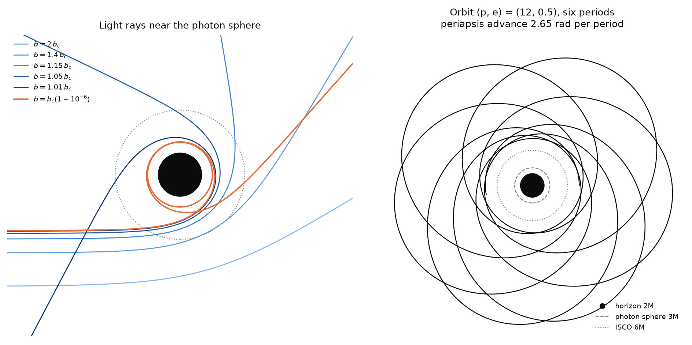

# geodesic-integrators

A reproducible comparison of **numerical integrators for black-hole geodesics**: how their errors grow over long integrations, which physical invariants they conserve, and what each unit of accuracy costs.



Eight integrators run on timelike and null geodesics of the Schwarzschild metric. Classical Runge–Kutta (RK4) and the adaptive pairs DP5(4) and DOP853 are compared with geometric methods: Gauss–Legendre collocation of order 2, 4 and 6, and Tao's explicit symplectic scheme of order 2 and 4. Each runs in two formulations, the second-order geodesic equation and Hamilton's equations, and every error is measured against a closed-form reference built from elliptic integrals and functions.

## Key findings

- **Error growth (RQ1).** Over $`10^4`$ orbits the Runge–Kutta methods drift linearly in the mass shell and quadratically in phase. The symplectic methods keep the mass-shell error bounded and the phase error linear. Sixth-order Gauss–Legendre reaches round-off and then follows Brouwer's $`N^{1/2}`$ law.
- **Formulation (RQ2).** In Hamilton's form, energy and angular momentum are exact for every method. Gauss–Legendre applied to the second-order system, where it is symmetric but not symplectic, conserves just as well.
- **Cost (RQ3).** DOP853 is the cheapest method for short integrations at every accuracy. Over 1000 orbits only sixth-order Gauss–Legendre reaches a phase error of $`10^{-8}`$.
- **Unstable orbits (RQ4).** On the photon sphere, accuracy buys $`\ln 10/2\pi`$ orbits per decade, up to about six orbits in double precision for every method, and plain floating-point summation fakes a longer survival. At the ISCO the time to plunge grows as $`\lvert\varepsilon\rvert^{-1/4}`$ in the size of the error, and its sign decides whether the orbit plunges at all.

The [results page](results.md) has the figures and tables. The full write-up is the [report](../report/main.pdf), with a [one-page summary](../report/summary.pdf).

## Where to start

- [Theory](theory/formulations.md): both formulations, their invariants, and why $`E`$ and $`L_z`$ are exact in Hamilton's form.
- [Integrators](integrators.md) and [test cases](testcases.md): what is compared, and against what.
- [Reproducibility](reproducibility.md): `make all` regenerates every figure, table and the report.
- [Extending to Kerr](extending.md): what a new metric needs, and what it must not touch.
- [Decisions](decisions/README.md) and the [development log](devlog.md): why the code looks the way it does, and what went wrong on the way.

## Quick start

```bash
git clone https://github.com/NugiePhysics/geodesic-integrators.git
cd geodesic-integrators
uv sync --all-extras
make test        # fast tests
make all         # every figure and table (about 25 minutes from scratch), then the report
```

```python
from geoint.experiments import RunSpec, solve
from geoint.testcases.schwarzschild import Eccentric

case = Eccentric(20.0, 0.5, n_orbits=10)          # (p, e) = (20, 0.5), ten radial periods
solution, form = solve(RunSpec.make(case, "b", "GL3", n_steps=10_000))
print(case.errors(solution, form))                  # phase error, mass shell, ...
```
