# Results

Every figure and table on this page is produced by a script in [`experiments/`](../experiments/) and regenerated by `make figures` ([Reproducibility](reproducibility.md)). The [report](../report/main.pdf) discusses the same results at greater length.

## Verification on geodesics

Every fixed-step method reaches its theoretical order in both formulations: within ±0.05 on the strong-field orbit $`(7.5, 0.5)`$, and within ±0.08 on the deflection $`b = 6`$. The adaptive pairs show tolerance proportionality (error $`\propto \mathrm{tol}^{0.85\text{–}1.04}`$), on the same curves as SciPy's.

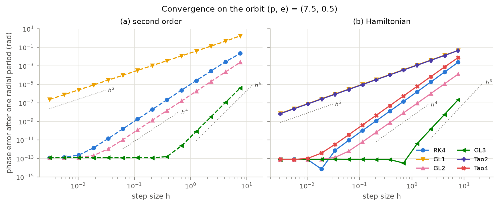

<!-- include: results/summary/t3_orders.md -->

*F4 and T3: error against step size, and measured orders with the standard error of the fit.*

## RQ3, short integrations: DOP853 is the cheapest everywhere

To reach $`10^{-10}`$ in formulation (b), DOP853 needs $`1.4`$–$`3.2\times10^3`$ evaluations. GL3, the best fixed-step method, needs $`1.6`$–$`3.6\times10^4`$, and RK4 $`3.5\times10^4`$–$`1.7\times10^5`$. Tao4 costs 1.2–10 times as much as RK4 for the same error.

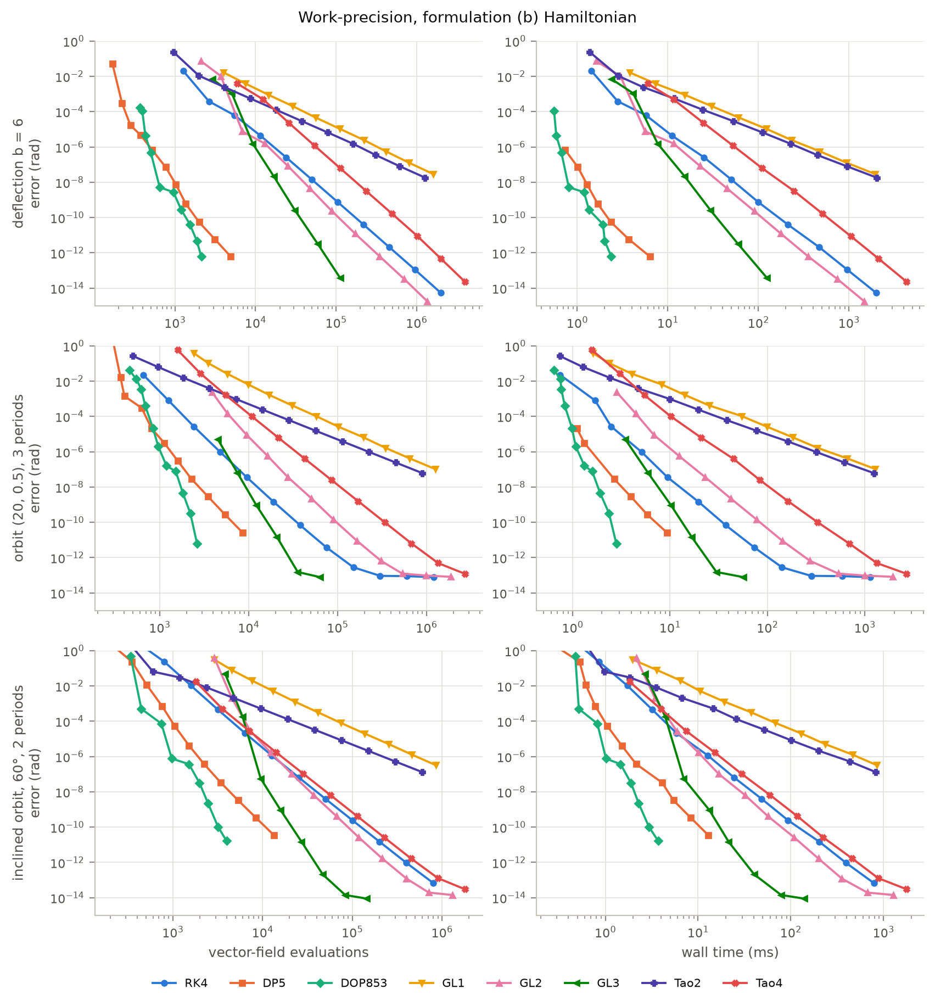

<!-- include: results/summary/t5_cost_to_target.md -->

*F6 and T5: evaluations (and milliseconds) needed to reach $`10^{-6}`$ and $`10^{-10}`$ on three short problems. A dash means the target was not reached in the sweep. [Formulation (a)](../figures/F06_work_precision_a.png).*

The deflection angle is reproduced to $`10^{-14}`$ far from the hole and to $`10^{-11}`$ at $`b - b_c = 10^{-3}`$ (F2). Near $`b_c`$ the winding error grows exactly like the condition number $`1/(b - b_c)`$, 440 times larger in (a) than in (b) (F12). The periapsis advance matches $`\Phi - 2\pi`$ to $`4\times10^{-13}`$ (F13).

| | |
|---|---|
| 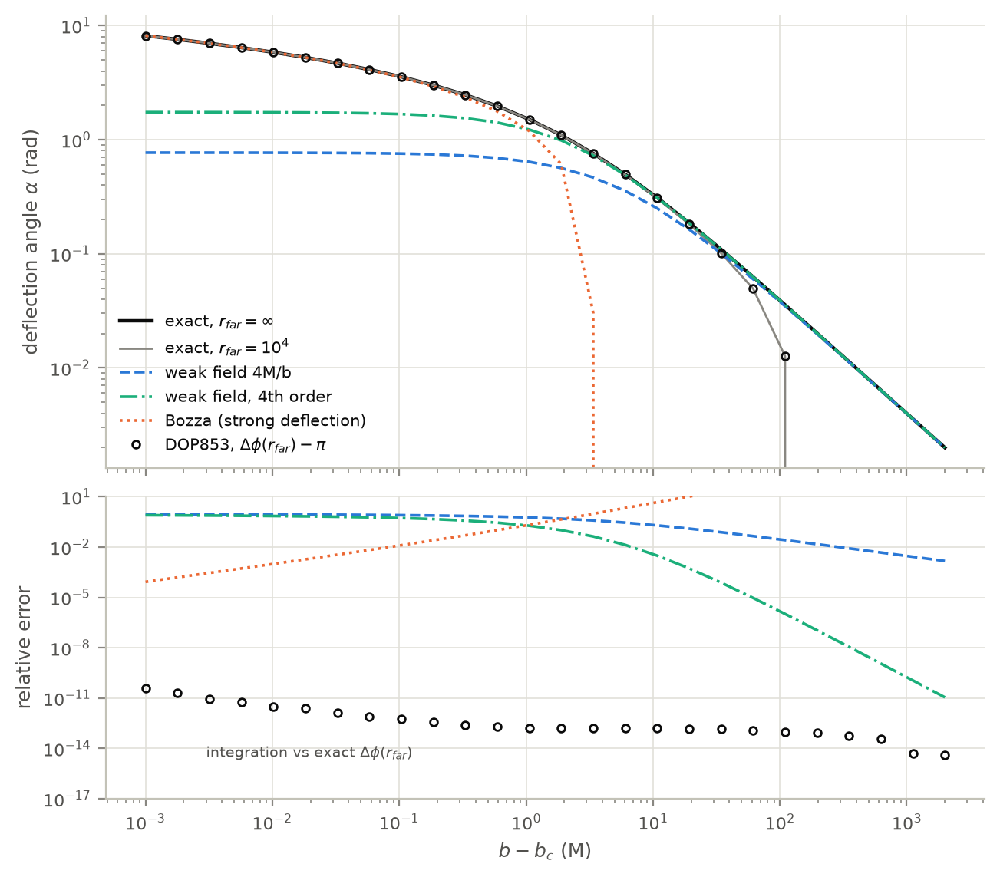 | 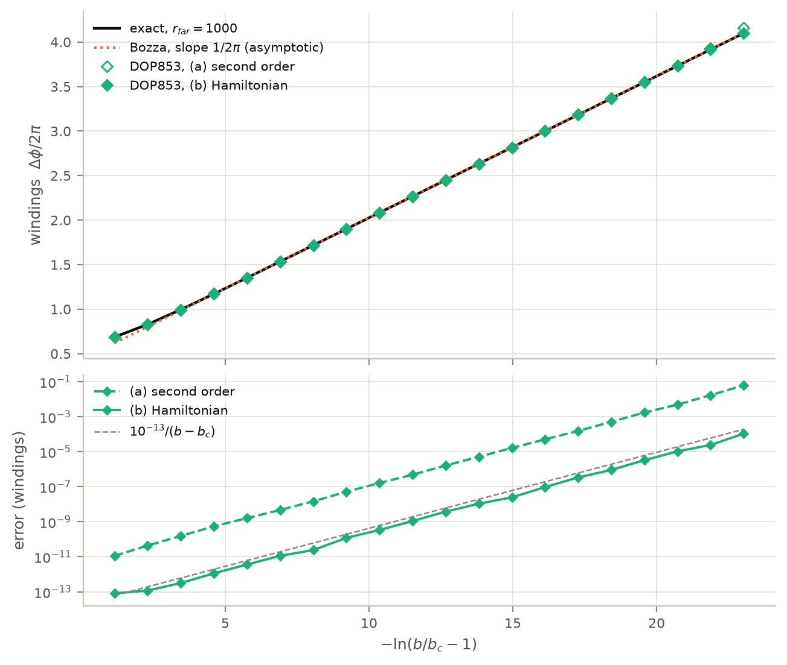 |
| 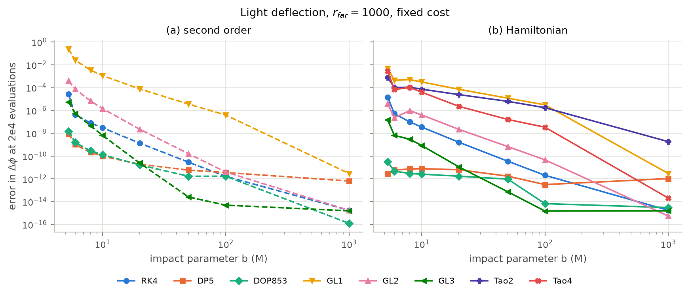 | 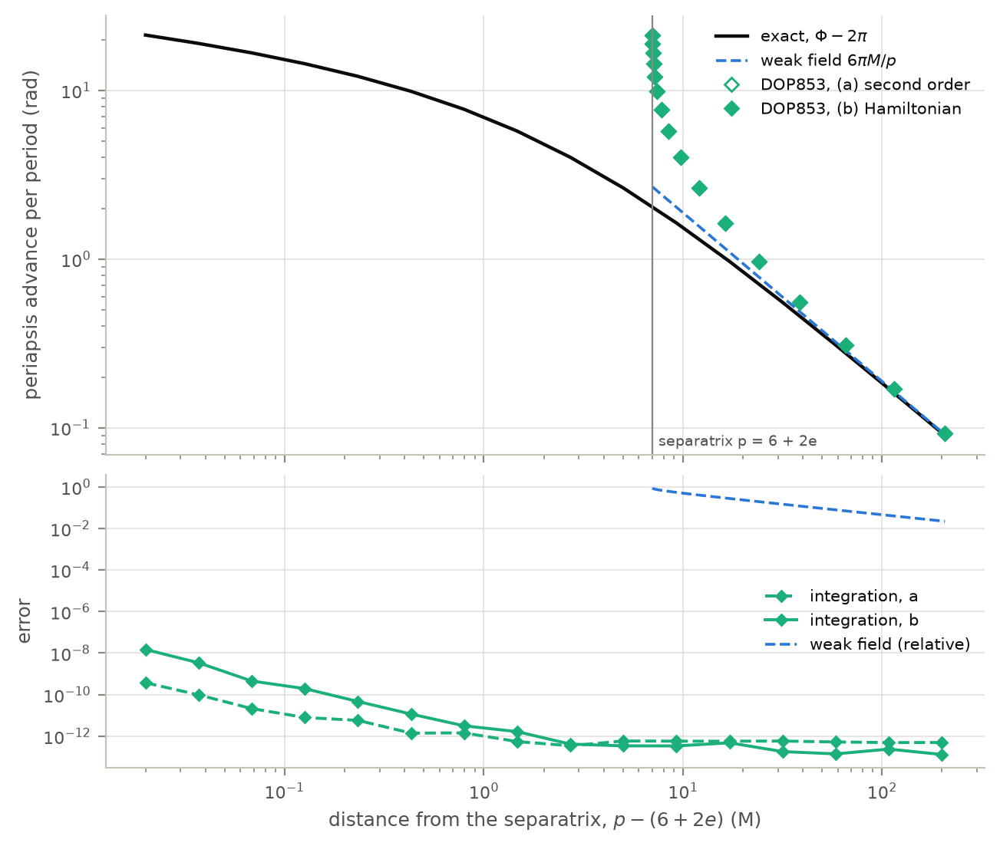 |

## RQ1, long integrations: linear against bounded

Over $`10^4`$ periods of $`(20, 0.5)`$, RK4, DP5 and DOP853 drift linearly in the mass shell (exponents $`1.000 \pm 0.002`$). GL1, GL2, Tao2 and Tao4 stay bounded. GL3 sits at round-off and follows Brouwer's random walk (exponent 0.48).

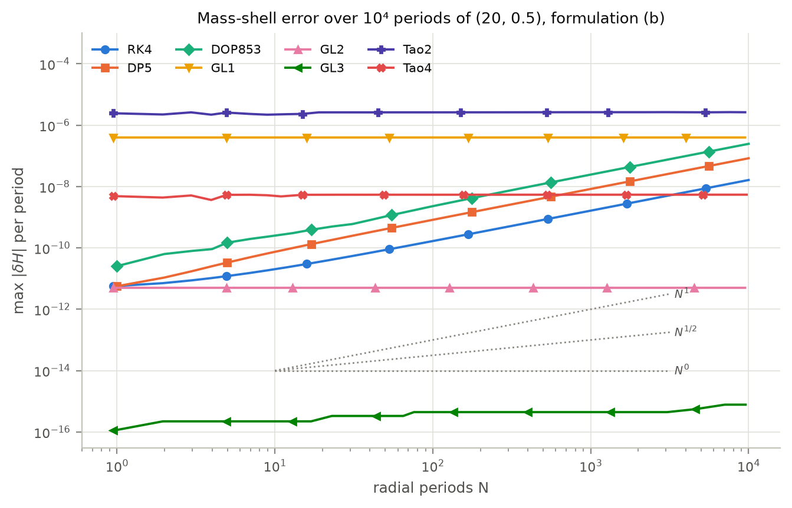

The phase error at the $`N`$-th periapsis is quadratic for the Runge–Kutta methods and linear for the geometric ones. For RK4 in (b) a constant frequency error and a drift of opposite sign cancel near $`N = 3400`$.

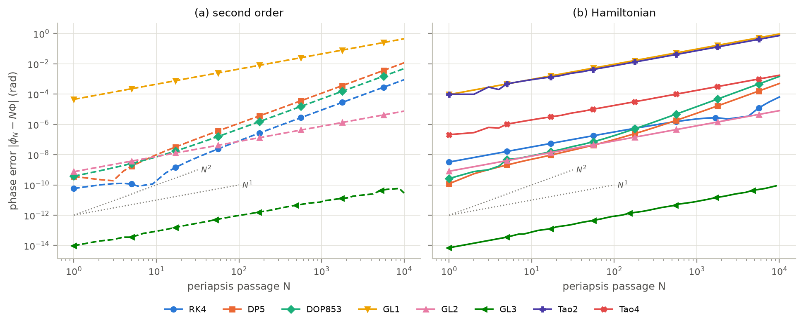

<!-- include: results/summary/t4_growth.md -->

*T4: growth laws over $`10^4`$ periods ([data](../results/summary/t4_growth.csv)). Exponents are log-log slopes over the last decade; $`c_1`$, $`c_2`$ fit $`\phi_N - N\Phi = c_1N + c_2N^2`$.*

**Round-off.** On the circular orbit $`r_c = 10`$ only round-off acts. After $`10^7`$ steps the phase error is $`5.1\times10^{-11}`$ with compensated summation and $`5.5\times10^{-6}`$ without, growing like $`N^2`$.

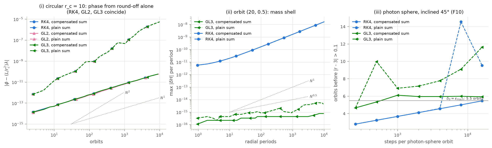

## RQ2, the formulation

In (b), $`E`$ and $`L_z`$ do not change at all, for any method. In (a) the Runge–Kutta methods drift in $`E`$, $`L_z`$ and the norm, while the Gauss methods stay bounded.

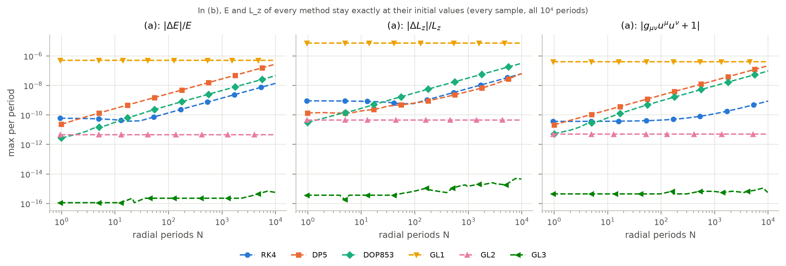

GL2 in (a) is symmetric but not symplectic in $`(x, u)`$. It conserves exactly as well as in (b): the largest $`\lvert\delta H\rvert`$ is $`5.0138\times10^{-12}`$ in both.

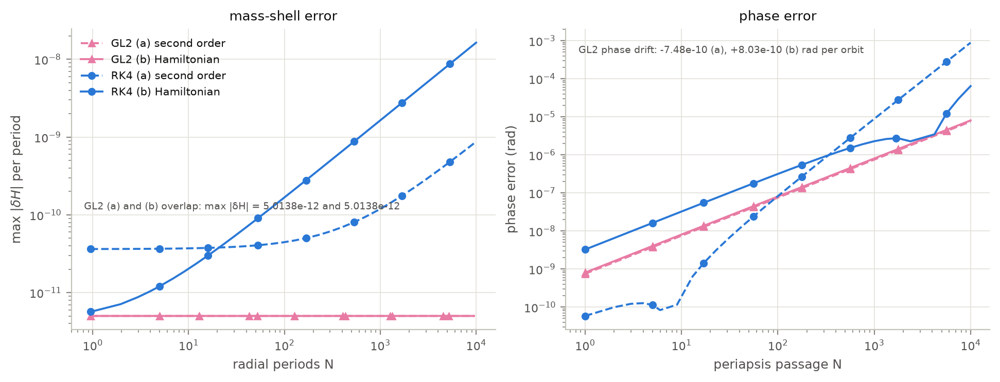

On inclined orbits $`L^2`$ is bounded for the Gauss methods and drifts for the Runge–Kutta ones. The orbital plane turns by a spurious precession of the node, linear in time for every method. Near the pole (85°) formulation (b) is the worse one.

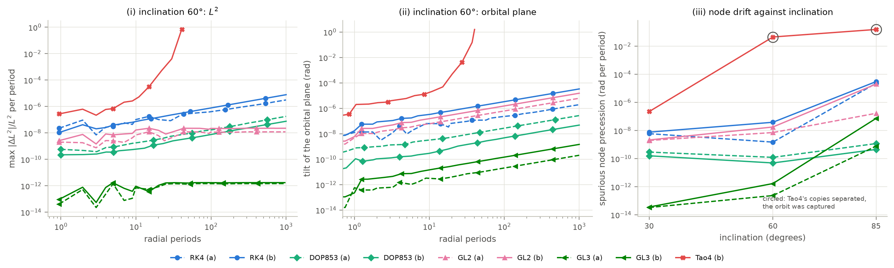

## RQ3, long integrations: the ranking turns over

Over 1000 periods DOP853 is still the cheapest method for a phase error of $`10^{-4}`$, but only GL3 reaches $`10^{-8}`$, at about $`6\times10^3`$ evaluations per period.

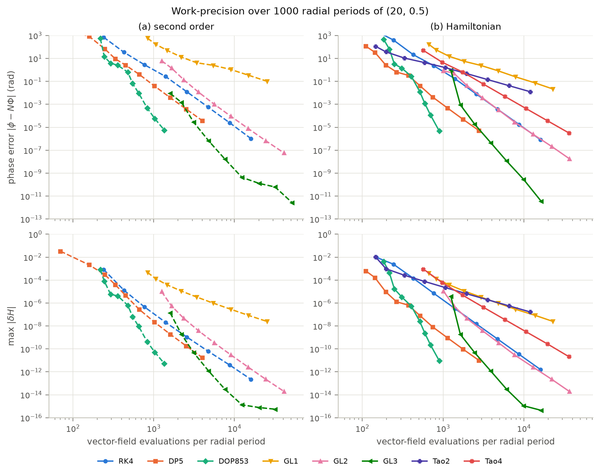

<!-- include: results/summary/t5b_cost_long.md -->

*T5b: evaluations per period over 1000 periods of $`(20, 0.5)`$.*

## RQ4, unstable and marginal orbits

**Photon sphere.** Every decade of tolerance buys about $`\ln 10/2\pi = 0.37`$ orbits, and every decade of steps $`0.37p`$ for a method of order $`p`$. GL3 saturates at about six orbits, the round-off limit. Plain summation fakes a longer survival: 14.5 orbits against 5.0 for RK4 at 8000 steps per orbit (F19, panel iii).

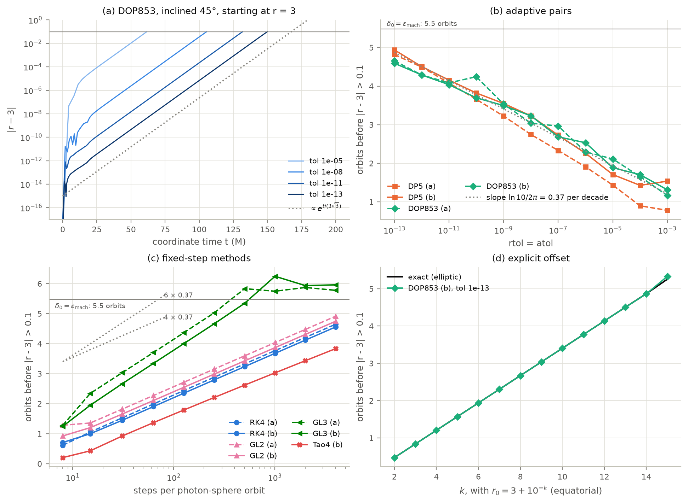

<!-- include: results/summary/t6_photon_sphere.md -->

*T6: orbits gained per decade, against the prediction.*

**ISCO.** At the inflection point of the effective potential an integration error acts as a constant force $`\varepsilon`$: $`\ddot\delta = \varepsilon - \delta^2/1296`$ with $`r = 6 + \delta`$. For $`\varepsilon > 0`$ the orbit stays bound; for $`\varepsilon < 0`$ it plunges after a time $`\propto \lvert\varepsilon\rvert^{-1/4}`$, so as $`n^{p/4}`$ in the steps per orbit. Measured slopes: 1.07–1.11 for the order-4 methods, 1.53 for GL3 (predicted 1.5), and $`-0.252`$ against tolerance for DP5 (predicted $`-0.25`$).

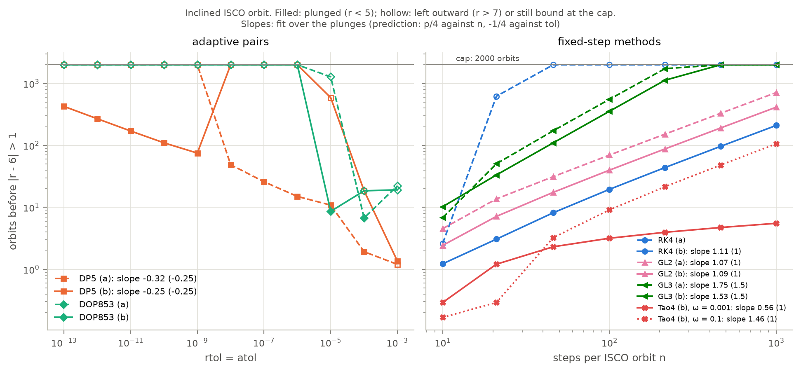

## Method details

| | |
|---|---|
| 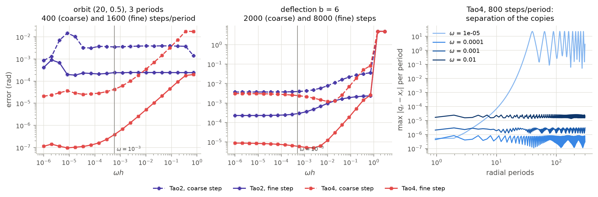 | 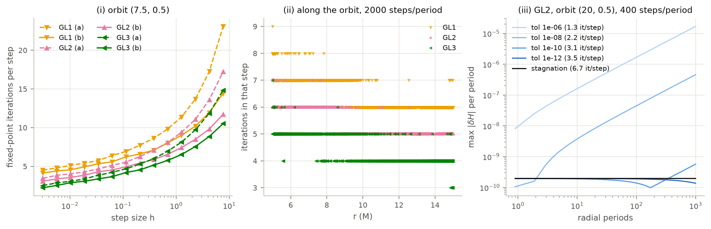 |

*F14: Tao4's error against $`\omega`$; $`\omega = 10^{-3}`$ is used throughout, but fails on the ISCO and on inclined orbits ([ADR 0006](decisions/0006-tao-coupling.md)). F15: iterations per step of the Gauss methods, and the drift caused by stopping the iteration at a tolerance.*

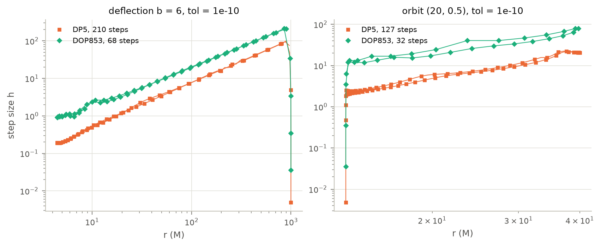

*F16: step sizes of the adaptive pairs.*

## Recommendations (RQ5)

| Task | Recommendation | Evidence |
|---|---|---|
| Ray tracing, short integrations | DOP853 in formulation (b) | Cheapest at every accuracy (T5); exact $`E`$, $`L_z`$, up to 440 times more accurate than (a) near $`b_c`$ |
| Long orbit evolution where the phase matters | GL3 in (b), iterated to stagnation, compensated summation | Only method to reach a phase error of $`10^{-8}`$ over 1000 periods (T5b); bounded invariants (F7) |
| Long runs at modest accuracy | DOP853 is cheaper, but its invariants drift linearly | T5b, F7, F9 |
| Bounded invariants needed (Poincaré sections, statistics) | A Gauss method with fixed step, either formulation | F17, F18 |
| Unstable orbits | Any accurate method with compensated summation; at most about 6 orbits | F10, T6, F19 |
| Explicit symplectic integration of a general metric | Tao only with $`\omega`$ tuned to the problem | ADR 0006, F11, F18 |

*T7.*
